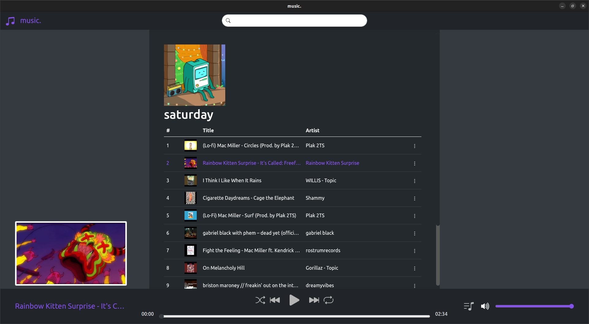
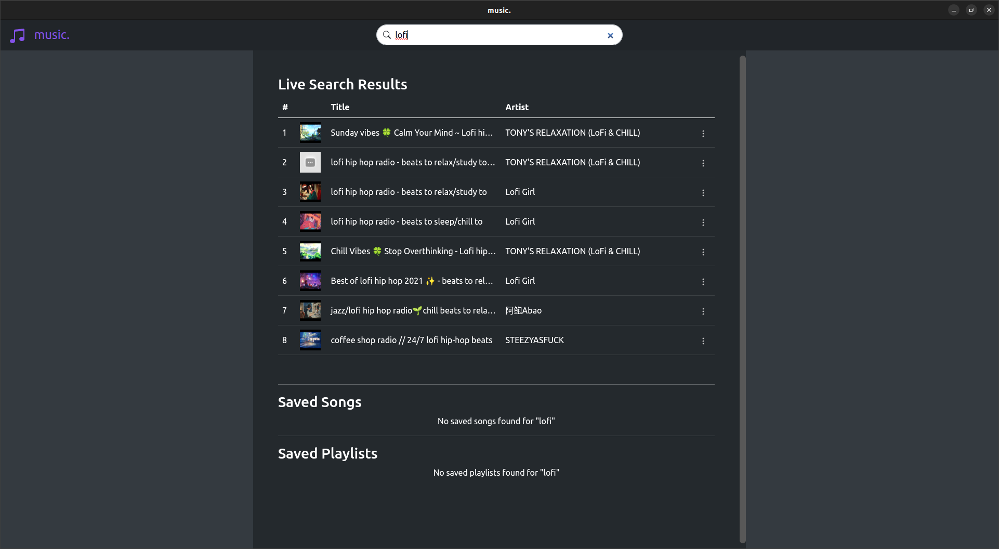
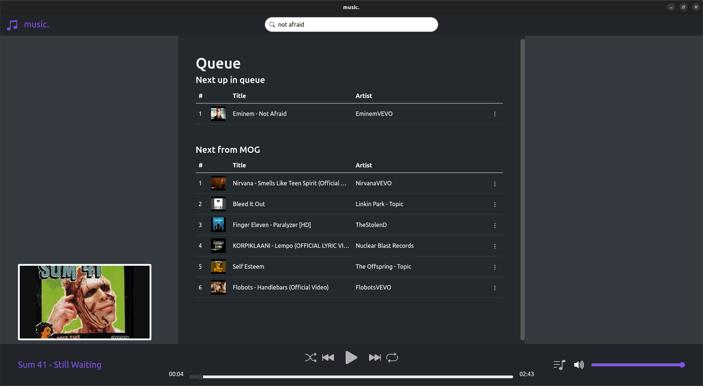

# music.
Online music streaming desktop application.

# Description
music. is a music streaming wrapper of YouTube with features common of other audio streaming services such as shuffle play, repeat, playlist management, and a queue system. music. works by operating via the YouTube library meaning you have access to anything found on YouTube.

# Screenshots




# Installation
1. Clone and navigate to the music. directory
2. Type: ```npm install```
3. Type: ```npm run build-os``` where os is one of windows, linux, or mac. This will create a folder named music-os-architecture replaced with your computer's os and architecture.  
  -Note that windows & mac builds are not tested and therefore may not work. Additionally windows icon may not show since it is not the correct format.
4. The program should now run, however, live search will not be immediately available. To activate live search follow the instructions below

# Live Search Activation
Live search requires Google api keys. You can generate one (or more) keys with a Google account and by following this [guide](https://developers.google.com/youtube/v3/getting-started). Currently there is no easy ui way to load api keys into the app.
1. Generate one or more Google api keys
2. Run the executable, located in the build folder you created, and then close it.
3. Navigate to the build folder, music-os-architecture/resources
4. Open save.json and look for the "keys": []
5. In between the [] brackets enter a comma separated list of strings where each string is an api key.
6. Once done, make sure to save the file.

If done correctly your save.json should look something like this:  
```{"keys": ["google generated api key", "google generated api key"],"playlists":{}}```

While only one api key is needed, you may wish to enter more because each api key has a daily search limit. If you exceed this limit, the search will fail. The applicaition will automatically switch to your new key which is not rate limited.
